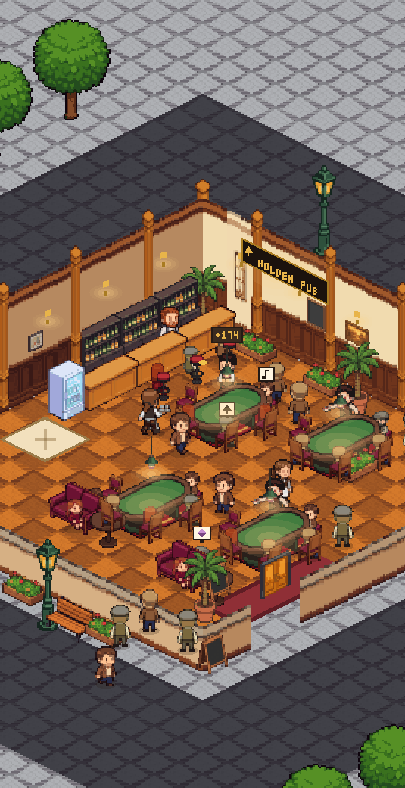
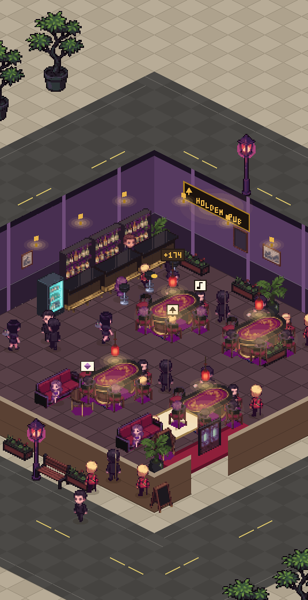

# 홀덤펍 키우기 — 아이소메트릭

홀덤펍을 운영하는 2D 아이소메트릭 경영 게임. 빌드 도구 없이 `index.html`을 그대로
열면 돌아간다.

| 클래식 | 가부키초 |
|---|---|
|  |  |

## 무엇으로 만들었나

빌드리스 바닐라 JS + Canvas 2D. 번들러도 프레임워크도 없다.
스프라이트는 이미지 생성 모델로 시트째 뽑아 직접 만든 파이프라인으로 구워 쓴다.

```
js/pub-scene-2d.js     아이소메트릭 렌더러 (타일 32×16, 화면에는 ×2)
js/game.js, data.js    경제 · 업그레이드 · 딜러 로직
tools/pack-build.mjs   생성 시트를 잘라 게임 에셋으로 굽는다
tools/pack-spec.mjs    모든 에셋의 크기를 정하는 기준표 (실제 치수 m 단위)
assets/pack/<테마>/    구워진 에셋. 테마 5종이 같은 파일 이름을 쓴다
```

테마 전환은 렌더러가 읽는 **폴더 하나를 바꾸는 것**이 전부다.
현재 테마: `classic` `japanese` `kabukicho` `neon` `european` `princess`.

## 돌려 보기

```bash
# 정적 서버 아무거나
npx serve .          # 또는 python -m http.server

# 브라우저 없이 한 프레임 렌더해서 확인 (에셋 로드 · 배치 · 탭 판정까지 검사)
node tools/scene2d-preview.mjs 6 0.8     # → tools/_preview/scene2d.png

# 새 테마 굽기
node tools/pack-build.mjs <테마> --write
```

Node 18+ 면 된다. 의존성 없음 — PNG 디코딩까지 내장 `zlib`으로 직접 한다.

## 에셋 만들기

`tools/PROMPTS.md`에 시트 구성(칸 순서 12개 × 4장)과 생성 프롬프트 규칙이 있다.
`assets/raw/sheets/`의 원본은 저장소에 넣지 않는다 — 구워진 결과만 커밋한다.

## 문서

- `CLAUDE.md` — 작업 메모. 설계 근거와 "다시 밟지 말 것"이 여기 있다.
- `docs/legacy-log.md` — 전신 프로젝트(holdem-pub-tycoon)의 전체 개발 로그.

## 라이선스

MIT (`LICENSE` 참고).
